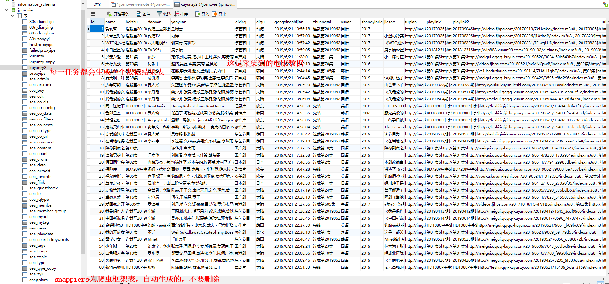
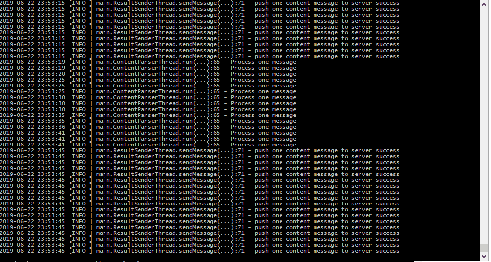
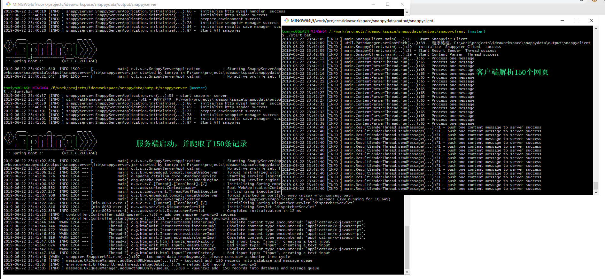
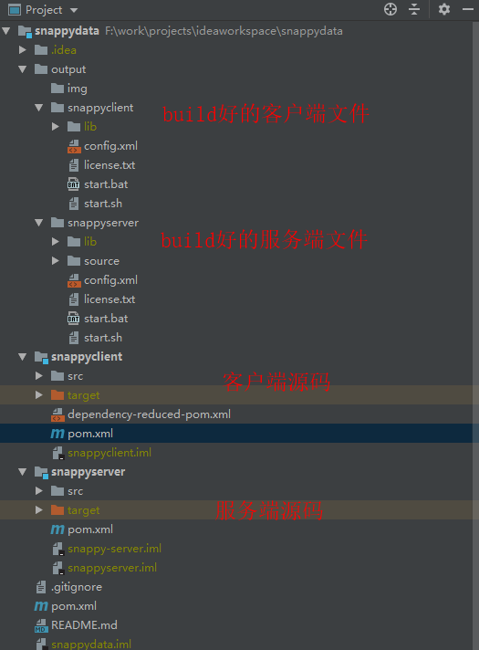

- 作者 何坤<3163172384@qq.com>， 个人博客：http://blog.tomiyo.cn, 兔密友搜索引擎：http://tomiyo.cn
- 工具仅供交流学习，不能用于商业用途

## 版本更新
v2.0    2019/06/22 
- 服务端改造成springboot

## snappy爬虫能做什么

能稳定，准确，快速，集群爬取规则网页的数据，并存储到mysql中。 如
- 爬取酷云电影资源 http://www.kuyunzy1.com ，
- 爬取安居客新房和二手房数据 https://shanghai.anjuke.com/sale/?from=navigation
- 其他网站资源
## snappy有什么优点
- 安装方便，编译打包成可执行程序方便
- 开源，可以一起完成更强大的功能
- 数据不遗漏，比如安居客二手房，没一秒就有好多数据产生，如果每一页每一条串行爬取，效率低，还可能漏爬。
- 可用集群分布式多台机器爬取，如果网页数据产生太多，如安居客二手房房源，发现当前爬取慢，只要再找一台服务器启动一个客户端就行了。动态扩展算力。
- 服务端和客户端都可以自定义爬虫数量
- 理论支持无上限任务

## 快速开始
##### 启动server 和 client
- 克隆本项目到你机器上： git clone https://github.com/peintune/snappydata.git
- 在项目的根路径执行打包命令：mvn clean package
- 配置 output/snappyserver 和 里面 config.xml文件里的mysql连接信息为你本机或者云端mysql的信息
- 打包完成后，启动server, 进入output/snappyserver目录，运行start.bat
- 启动client 进入output/snappyclient目录，运行start.bat

##### 执行任务
- 在浏览器中输入demo任务 http://localhost:8080/message/addSnappier?folder=demo&filerex=kuyunzy2 并回车 （添加一个任务）
- 在浏览器中输入 http://localhost:8080/message/startSnappier?folder=demo&filerex=kuyunzy2  并回车 （执行一个任务）

##### 查看采集的数据
- 查看你的mysql中会生成一张 kuyunzy2 的表，可以看到里面采集好的数据

- 查看client端

- 服务端和client端

## 项目结构

## 如何新添加一个任务，如爬取anjuke 
- 在output/source创建任务文件夹如 anjuke
- 复制 output/source/demo目录下的kuyunzy2.xml 文件到anjuke目录下，改名为anjuke.xml
- 修改anjuke.xml里面的内容， 里面只要带‘修改‘ 字样的项都要安装你要爬取的页面相关的修改
- 在浏览器中输如 http://localhost:8080/message/addSnappier?folder=anjuke&filerex=anjuke 并回车 （添加一个任务）
- 在浏览器中输入 http://localhost:8080/message/startSnappier?folder=anjuke&filerex=anjuke  并回车 （执行一个任务）
- 查看server端和client的日志是否报错，如有，根据相关错误调试anjuke.xml中的内容
- 查看mysql中的数据是否完整，如不完整，检查xml中的column 中的xpath值是否正确